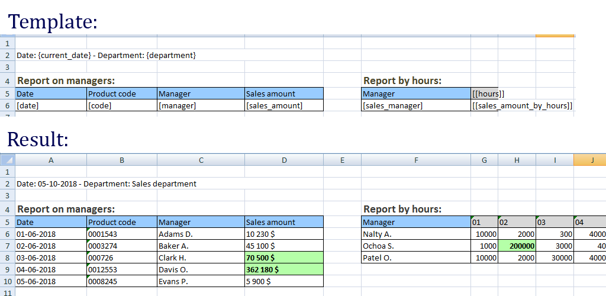

# PHP Excel Templator

[](https://packagist.org/packages/alhimik1986/php-excel-templator)
[](https://packagist.org/packages/alhimik1986/php-excel-templator)
[](https://packagist.org/packages/alhimik1986/php-excel-templator)
[](https://packagist.org/packages/alhimik1986/php-excel-templator)
[](https://packagist.org/packages/alhimik1986/php-excel-templator)
[](https://packagist.org/packages/alhimik1986/php-excel-templator)

PHP Excel модуль, позволяющий экспортировать excel-файлы из excel-шаблона.
Теперь не нужно при помощи кода с нуля создавать excel-файлы, прописывать в нём стили и т. д.

Демонстрация:



## Простой пример
Самый простой пример, как это может выглядеть (с минимальным количеством кода):
Допустим, у нас есть excel-файл со следующими шаблонными переменными:


Код будет выглядеть следующим образом:
```
use alhimik1986\PhpExcelTemplator\PhpExcelTemplator;

PhpExcelTemplator::saveToFile('./template.xlsx', './exported_file.xlsx', [
	'{current_date}' => date('d-m-Y'),
	'{department}' => 'Sales department',
]);
```
В результате мы получим:


С помощью этого модуля мы просто создаём файл шаблона с нужными нам стилями, указываем в нём шаблонные переменные. А в коде мы лишь передаём параметры, в которых указываем какое значение поместить в указанную шаблонную переменную.

## Характеристики
- Возможность вставить несколько шаблонных переменных в одной ячейке таблицы (если тип данных "строка")
- Возможность вставить одномерный массив, в этом случае в таблице будут создаваться дополнительные строки
- Возможность вставлять двумерный массив, в этом случае в таблице создаются соответствующие колонки и строки
- Всталяя значение в ячейки можно менять и стили этих ячеек, даже при вставке массивов
- Возможность применять один и тот же шаблон на нескольких листах таблицы

Демонстрация характеристик и примеры использования приведены в папке samples.

## Ограничения:
- Возможны так называемые побочные эффекты при использовании нескольких одномерных или двумерных массивов, чередующихся в определенных местах. Пример побочных эффектов также приведён в папке samples.

## УСТАНОВКА:

```
$ composer require alhimik1986/php-excel-templator
```

### Правила именования шаблонных переменных
Правила могут быть любыми, но я могу предложить свою рекомендацию по именованию шаблонных переменных:
- {var_name} - для строковых значений
- [var_name] - для одномерных массивов
- [[var_name]] - для двумерных массивов


### Как вставить одномерный массив, чтобы в таблице создавались не строки, а столбцы?
Для этого вместо одномерного массива вставляем двумерный следующим образом:
```
$param['[[var_name]]'] = [['text 1', 'text 2', 'text 3']];
```

## Испрользование сеттеров
В примере выше использовался минимальный код без сеттеров.
В нём тип данных (например: строка, одномерный массив или двумерный массив) распознаётся автоматически и подставляется нужный сеттер.
Но если мы хотим использовать определённый сеттер, тогда тот же самый код будет выглядеть следующим образом:
```
use alhimik1986\PhpExcelTemplator\PhpExcelTemplator;
use alhimik1986\PhpExcelTemplator\params\ExcelParam;
use alhimik1986\PhpExcelTemplator\params\CallbackParam;
use alhimik1986\PhpExcelTemplator\setters\CellSetterStringValue;

$params = [
	'{current_date}' => new ExcelParam(CellSetterStringValue::class, date('d-m-Y')),
	'{department}' => new ExcelParam(CellSetterStringValue::class, 'Sales department'),
];
PhpExcelTemplator::saveToFile('./template.xlsx', './exported_file.xlsx', $params);
```
На данный момент существует 3 вида сеттеров:
- CellSetterStringValue (для строчных значений)
- CellSetterArrayValue (для одномерных массивов)
- CellSetterArray2DValue (для двумерных массивов)

Вы спросите, для чего указывать сеттеры явно?
Во-первых, для гибкости: вдруг вы захотите создать собственный сеттер со своими алгоритмами, которые устраняют упоминаемые мной побочные эффекты.
Во-вторых, в каждом сеттере можно передавать функцию обратного вызова, в которой мы можем менять стили вставляемых ячеек. Например, нужно отметить жирным шрифтом сотрудников, которые отличились в этом месяце.

Примеры кода, в котором используются все виды сеттеров, приведены папке samples.
